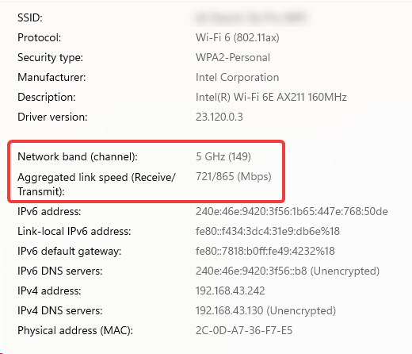

# 文件同步工具

本工具的目标是在局域网内同步文件.

使用场景:

- 本机项目克隆给目标机器, 通过局域网完成.
- 目标机器的本地项目已过时, 但部分文件做了独有的修改, 将本机的最新代码和目标进行 **双向** 同步, 并确保冲突文件得以保留 (存到冲突待处理区).

## 为什么不...

- 为什么不使用 FreeFileSync?

  本工具的差异点:

  - 可以通过类似 ".gitignore" 的方式排除文件.
  - 和 Android 通过 FTP 同步, FreeFileSync 会导致时间戳的时区错误.
  - 和 Android 通过 FTP 同步, FreeFileSync 无法处理隐藏文件 (夹).
  - 在大量碎文件的传输上, 本工具有特殊的优化方法.
  - 本工具为 Python 项目, 可二次编程定制.

- 为什么不使用 Git?

  - 本工具不走外网, 不涉及账号, 权限, 代理等问题.
  - 接收方不熟悉 Git 等工具的使用, 也不希望用过于专业的方式 (比如 commit, merge, pull request 等) 去做长期维护.
  - 本工具支持 PC - Android 同步, 而后者的 Git 客户端 (目前主要有 MGit) 并不好用.

  不过, 如果是专业人员, 仍然推荐使用 Git 管理.

- 为什么不使用坚果云?

  - 本工具坚持使用局域网传输.
  - 本工具有更完善的文件排除规则.
  - 本工具有更加可编程的控制方式.

## 安装

### PC

```sh
pip install file-sync-pro  # TODO
```

...

### Android

1. 下载 Termux

2. 配置 Termux

   1. 允许访问所有文件

   2. 安装 Python 及其依赖

      ```sh
      ...
      pip install -r http://172.20.128.132:2135/reqlock/file_sync_pro.txt
      ```

   3. 开启 SSH

      ```sh
      # setup password
      passwd
      #   ...
      
      # start service
      sshd
      
      # if kill service
      pkill sshd
      ```

      注意: 请保持 Termux 应用在前台, 否则 PC 端可能会连不上.

## 使用

### PC

...

通过 WebUI:

```sh
strun 2163 src/file_sync_pro/ui.py
```

界面:


## Android

1. 打开 Termux, 开启 SSH

2. PC 端连接 SSH:

   ```sh
   ssh <android_ip> -p 8022
   #   first time connection, type "yes" when console asks if continue connecting.
   #   prompt to input password.
   # --- ssh ---
   # if file-sync-pro package has updated, redo pip install:
   #   pip install -r http://172.20.128.132:2135/reqlock/file_sync_pro.txt
   # run server
   python -m file_sync_pro run_air_server
   #   server running at 0.0.0.0:2160
   ```

同步快照:

安卓切换应用到 Solid Explorer, 开启 FTP 服务, 并保持应用在前台.

来到 PC 端的控制台:

```sh
# dry run
pox -m file_sync_pro sync_snapshot \
    C:/Likianta/documents/gitbook/source-docs/snapshot.json \
    ftp://192.168.8.31:2160/Likianta/documents/gitbook/source-docs/snapshot.json \
    -d
# execute
pox -m file_sync_pro sync_snapshot \
    C:/Likianta/documents/gitbook/source-docs/snapshot.json \
    ftp://192.168.8.31:2160/Likianta/documents/gitbook/source-docs/snapshot.json
```

## 问题解答

### 局域网中的传输速度非常慢

- 尝试切换网络, 例如从公共网络切换到手机热点 (建议使用 5GHz 频段).

  笔者自己的经历是, 使用公共网络速度只有 40KB/s, 改用手机共享热点速度 10MB/s (百兆带宽级别).

  此外, 建议在设置中查看当前网络的传输能力:

  

### 文件没变化, 但是却提示大量覆盖操作

目前发现以下场景会导致出现此情况:

1. A 电脑和 B 手机通过 file-sync-pro 完成了同步
2. A 电脑和 C 电脑通过 git 完成了同步
3. 由于 A, C 电脑 git clone 的时间不同, 导致它们之间尽管文件内容相同, 但所有文件的 mtime 都不同
4. 此时 C 电脑想和 B 手机通过 file-sync-pro 同步, 由于 file-sync-pro 是基于时间戳校验的, 就产生了大量 `=>` 覆盖操作

以上情况还有更细节的地方需要说明:

如果 `C/file:mtime < A/file:mtime = B/file:mtime`, 那么控制台会有一条弱警告, 但不会给出覆盖操作; 

如果 `C/file:mtime > A/file:mtime = B/file:mtime`, 那么才会给出 `C => B` 的覆盖操作.

综上两条, 你会看到大量 `=>` "误报", 但不会看到 `<=` "误报".

另外, 对于 `+>` `->` `<+` `<-` 操作, 仍然能正确计算, 不受 git 同步影响.

