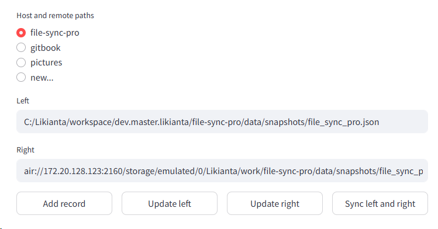

# 文件同步工具

本工具的目标是在局域网内快速地, 高效地 (以增量更新方式), 双向同步不同设备之间的文件.

使用场景:

- 两台设备 (可以是电脑或手机) 接入同一局域网, 同步某个文件夹的内容.
- 在不使用 Git 的情况下, 给非开发人员的电脑同步自己电脑的项目, 并在有需要时, 允许对方把他的修改再同步回自己的电脑上.
- 支持编写排除规则 (类似 .gitignore).

## 工作原理

假设有两个文件夹 A 和 B, 这两个文件夹可以在同一电脑上, 也可以在不同设备上 (但要求在同一局域网).

如何让 A 和 B 的文件树相同?

最简单的方法是将 A 复制到 B, 或反过来.

但考虑到 A 和 B 会分别积累一些变更操作 (增删文件 (夹), 修改文件内容等). 当 A 和 B 均发生变化后, 要想再同步, 该怎么 **高效率地** 做到? 这就是本工具的工作重点.

首先, 本工具会为 A, B 各创建一个快照文件.

快照文件是一个 JSON 格式的文件, 它包含了目标路径, 文件树时间戳等信息, 其格式大致如下:

```py
{
    "root": "some/path/to/A",
    "base": {
        "tree": {
            "foo.txt": 1755050328,
            "bar.png": 1613155218,
            ...
        }
    }
}
```

当 A 或 B 发生变化后, 新的快照文件中, 文件的时间戳会发生变化.

比较 A 和 B 的快照文件中的 tree 的时间戳差异, 就能得到一个变更列表.

变更列表有且仅有以下变更项:

- `A +> B`: A 相较于 B 新增的文件
- `A => B`: A 相较于 B 变化的文件
- `A -> B`: A 相较于 B 减少的文件
- `A <+ B`, `A <= B`, `A <- B`: 略.

补充说明: 如果两边的同一文件都发生了变化, 则将其中一个备份到 "conflicts" 目录, 供事后处理.

于是通过复制, 删除操作, 最终会完成 A B 文件夹的同步.

---

### 云同步原理

...

## 为什么不...

- 为什么不使用 FreeFileSync?

  本工具的差异点:

  - 可以通过类似 ".gitignore" 的方式排除文件.
  - 和 Android 通过 FTP 同步, FreeFileSync 会导致时间戳的时区错误.
  - 和 Android 通过 FTP 同步, FreeFileSync 无法处理隐藏文件 (夹).
  - 在大量碎文件的传输上, 本工具有特殊的优化方法.
  - 本工具为 Python 项目, 可二次编程定制.

- 为什么不使用 Git?

  - 本工具不走外网, 不涉及账号, 权限, 代理等问题.
  - 接收方不熟悉 Git 等工具的使用, 也不希望用过于专业的方式 (比如 commit, merge, pull request 等) 去做长期维护.
  - 本工具支持 PC - Android 同步, 而后者的 Git 客户端 (目前主要有 MGit) 并不好用.

  不过, 如果是专业人员, 仍然推荐使用 Git 管理.

- 为什么不使用坚果云?

  - 本工具坚持使用局域网传输.
  - 本工具有更完善的文件排除规则.
  - 本工具有更加可编程的控制方式.

## 安装

### PC

```sh
pip install file-sync-pro  # TODO
```

...

### Android

1. 下载 Termux

2. 配置 Termux

   1. 允许访问所有文件

   2. 安装 Python 及其依赖

      ```sh
      ...
      pip install -r http://172.20.128.132:2135/reqlock/file_sync_pro.txt
      ```

   3. 开启 SSH

      ```sh
      # setup password
      passwd
      #   ...
      
      # start service
      sshd
      
      # if kill service
      pkill sshd
      ```

      注意: 请保持 Termux 应用在前台, 否则 PC 端可能会连不上.

## 使用

本项目支持命令行用 UI 两种用法. 先介绍 UI 的用法:

### Web UI

```python
strun 2163 src/file_sync_pro/ui.py
```

...

## 命令行用法

#### PC

...

通过 WebUI:

```sh
strun 2163 src/file_sync_pro/ui.py
```

界面:



## Android

### 工作原理

Android 需要安装 Termux, 并在 Termux 中安装 Python 环境 (要求 Python 3.12 及以上版本).

使用 Python 以及待会儿 pip 安装好的 `file-sync-pro` 包, 才能在 Android 端开启 air server 服务, 这样 PC 端会和 air server 沟通, 完成所有 io 操作.

### 安装与环境配置

#### 首次安装 `file-sync-pro`

...

#### 升级 `file-sync-pro`

如果只升级 `file-sync-pro`, 不升级它的依赖, 下面是最快的方法:

```sh
python -m pip install http://<pc_host>:<dufs_port>/<file_sync_pro_dist>/<whl_file> --no-deps
```

如果还需要升级包括它的依赖:

```sh
python -m pip install -r http://<pc_host>:<dufs_port>/<file_sync_project>/requirements.lock
```

...

### 步骤

1. 打开 Termux, 开启 SSH

2. PC 端连接 SSH:

   ```sh
   ssh <android_ip> -p 8022
   #   first time connection, type "yes" when console asks if continue connecting.
   #   prompt to input password.
   # --- ssh ---
   # if file-sync-pro package has updated, redo pip install:
   #   pip install -r http://172.20.128.132:2135/reqlock/file_sync_pro.txt
   # run server
   python -m file_sync_pro run_air_server
   #   server running at 0.0.0.0:2160
   ```

同步快照:

安卓切换应用到 Solid Explorer, 开启 FTP 服务, 并保持应用在前台.

来到 PC 端的控制台:

```sh
# dry run
pox -m file_sync_pro sync_snapshot \
    C:/Likianta/documents/gitbook/source-docs/snapshot.json \
    ftp://192.168.8.31:2160/Likianta/documents/gitbook/source-docs/snapshot.json \
    -d
# execute
pox -m file_sync_pro sync_snapshot \
    C:/Likianta/documents/gitbook/source-docs/snapshot.json \
    ftp://192.168.8.31:2160/Likianta/documents/gitbook/source-docs/snapshot.json
```

## 技巧

### 使用文件夹时间戳缓存来提高快照速度

...

## 问题解答

### 修复错误的时间戳

由于一些历史原因或者其他未知因素导致, 在同步时, 我们可能会看到控制台有黄色的文字打印, 警告称 A 和 B 在 某个/某些 文件 (夹) 上存在时间戳逻辑不合理的问题.

为了解决这个问题, 我们要使用编程的方式修改它们的时间戳一致.

```sh
# get help
python -m file_sync_pro.doctor -h
# dry run
python -m file_sync_pro.doctor <snapfile_a> <snapfile_b> -d
# sync
python -m file_sync_pro.doctor <snapfile_a> <snapfile_b>
```

注意事项:

- 在 dry-run 模式下, 如果遇到红色的项, 这意味着该项所对应的文件内容存在差异. 你需要先使内容一致, 才能继续修复时间戳, 否则非 dry-run 模式下运行到这里会报错.
- 在非 dry-run 模式下运行完了以后, 使用 `update_snapshot` 来刷新 A, B 的快照文件. 建议刷新后再运行一次 dry-run 模式, 正常来说, 这时候就看不到异常的时间戳了.

### 局域网中的传输速度非常慢

- 尝试切换网络, 例如从公共网络切换到手机热点 (建议使用 5GHz 频段).

  笔者自己的经历是, 使用公共网络速度只有 40KB/s, 改用手机共享热点速度 10MB/s (百兆带宽级别).

  此外, 建议在设置中查看当前网络的传输能力:

  

### 文件没变化, 但是却提示大量覆盖操作

目前发现以下场景会导致出现此情况:

1. A 电脑和 B 手机通过 file-sync-pro 完成了同步
2. A 电脑和 C 电脑通过 git 完成了同步
3. 由于 A, C 电脑 git clone 的时间不同, 导致它们之间尽管文件内容相同, 但所有文件的 mtime 都不同
4. 此时 C 电脑想和 B 手机通过 file-sync-pro 同步, 由于 file-sync-pro 是基于时间戳校验的, 就产生了大量 `=>` 覆盖操作

以上情况还有更细节的地方需要说明:

如果 `C/file:mtime < A/file:mtime = B/file:mtime`, 那么控制台会有一条弱警告, 但不会给出覆盖操作; 

如果 `C/file:mtime > A/file:mtime = B/file:mtime`, 那么才会给出 `C => B` 的覆盖操作.

综上两条, 你会看到大量 `=>` "误报", 但不会看到 `<=` "误报".

另外, 对于 `+>` `->` `<+` `<-` 操作, 仍然能正确计算, 不受 git 同步影响.

